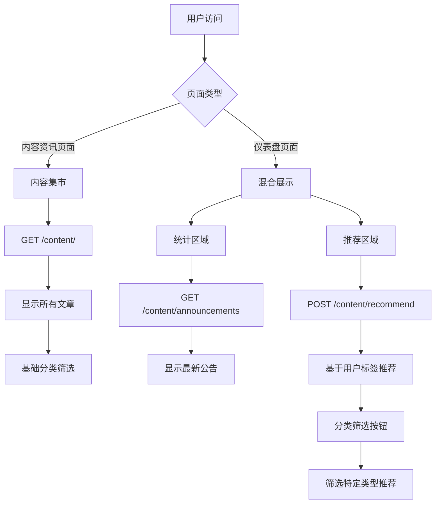

# 功能优化报告：内容集市 vs 个性化推荐

## 📋 优化概述

基于用户反馈，我们重新设计了系统的功能架构，明确区分了**内容集市**和**个性化推荐**两大功能模块，解决了功能混淆问题。

## 🎯 核心问题

### 原问题
- 标签推荐功能和内容展示功能混淆
- 统计数据和个性化推荐界限不清
- 用户体验不够清晰

### 解决方案
- ✅ 明确功能边界
- ✅ 重新设计交互流程  
- ✅ 增加分类筛选功能

## 📊 功能重新划分

### 1. 内容资讯页面 (`ContentList.vue`) - **内容集市**
```
🏪 内容集市特点：
├── 📚 显示所有文章（无个性化筛选）
├── 🔍 基础分类筛选（行情/政策/公告）
├── 🔎 搜索功能
├── 📊 内容统计
└── ⚡ 快速浏览

API调用：GET /content/ 
功能：纯内容展示，不涉及用户标签
```

### 2. 仪表盘页面 (`Dashboard.vue`) - **混合展示**

#### 统计展示区域（右侧）- 无标签
```
📈 统计数据区域：
├── 📊 咨询概览（总体统计）
├── 📢 最新交易公告（时间排序）
└── 💰 最新调价公告（时间排序）

特点：基于时间和类型的统计展示，无个性化
```

#### 个性化推荐区域（左侧）- 有标签
```
🎯 猜你喜欢区域：
├── 🏷️ [全部推荐] - 显示所有个性化推荐
├── 📈 [行情] - 筛选行情类推荐内容  
├── 📋 [政策] - 筛选政策类推荐内容
└── 📢 [公告] - 筛选公告类推荐内容

API调用：POST /content/recommend
功能：基于用户标签的精准推荐
```

## 🔧 技术实现

### 新增功能
1. **推荐分类筛选器**
   - 四个分类按钮：全部/行情/政策/公告
   - 响应式筛选逻辑
   - 动态空状态提示

2. **筛选逻辑**
```javascript
// 筛选推荐内容
const filterRecommendations = () => {
  let targetTypes = []
  switch (recommendationFilter.value) {
    case 'market': targetTypes = ['行情动态']; break
    case 'policy': targetTypes = ['政策法规']; break  
    case 'announcement': targetTypes = ['交易公告', '调价公告']; break
    default: filteredRecommendations.value = recommendations.value; return
  }
  
  filteredRecommendations.value = recommendations.value.filter(item => 
    targetTypes.includes(item.type)
  )
}
```

3. **响应式变量**
```javascript
const recommendationFilter = ref('all')        // 当前筛选条件
const filteredRecommendations = ref([])        // 筛选后的推荐内容
```

## 📊 数据流程图



## 🎨 用户体验优化

### 1. 明确功能定位
- **内容集市**：浏览全部内容，发现新信息
- **个性化推荐**：基于兴趣标签，精准匹配

### 2. 交互流程优化
```
内容资讯页面：
浏览所有内容 → 分类筛选 → 搜索查找 → 详情查看

仪表盘推荐：  
查看推荐 → 分类筛选 → 标签匹配 → 精准阅读
```

### 3. 视觉区分
- 推荐区域使用时间线样式
- 统计区域使用卡片样式
- 分类按钮使用按钮组样式

## 📈 预期效果

### 用户体验提升
- ✅ 功能边界清晰
- ✅ 操作逻辑简单
- ✅ 内容发现效率提高

### 技术架构优化
- ✅ API调用合理分工
- ✅ 前端组件职责明确
- ✅ 数据流向清晰

### 业务价值增强
- ✅ 内容消费路径优化
- ✅ 个性化体验提升
- ✅ 用户粘性增强

## 🔄 后续优化方向

1. **内容集市增强**
   - 添加收藏功能
   - 增加浏览历史
   - 支持内容评价

2. **推荐算法优化**
   - 引入协同过滤
   - 增加热度权重
   - 实现点击学习

3. **用户画像完善**
   - 行为分析
   - 兴趣挖掘  
   - 动态标签更新

---

**总结**：通过明确区分内容集市和个性化推荐，我们构建了更加清晰、高效的信息消费体验，既满足了用户的全面浏览需求，又提供了精准的个性化服务。 